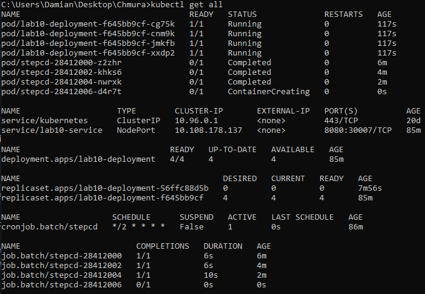
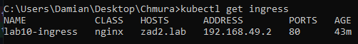
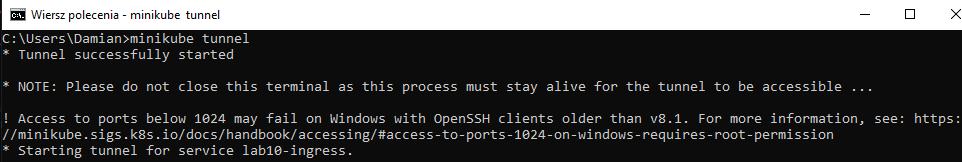
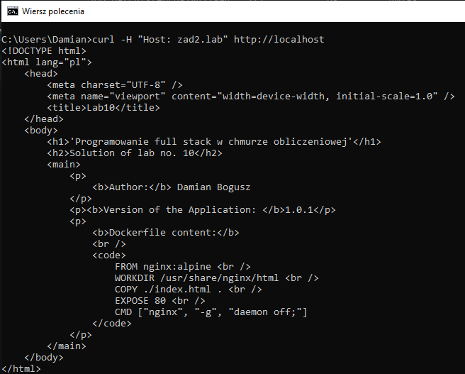
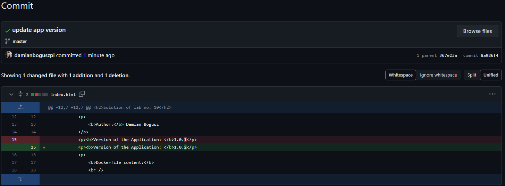
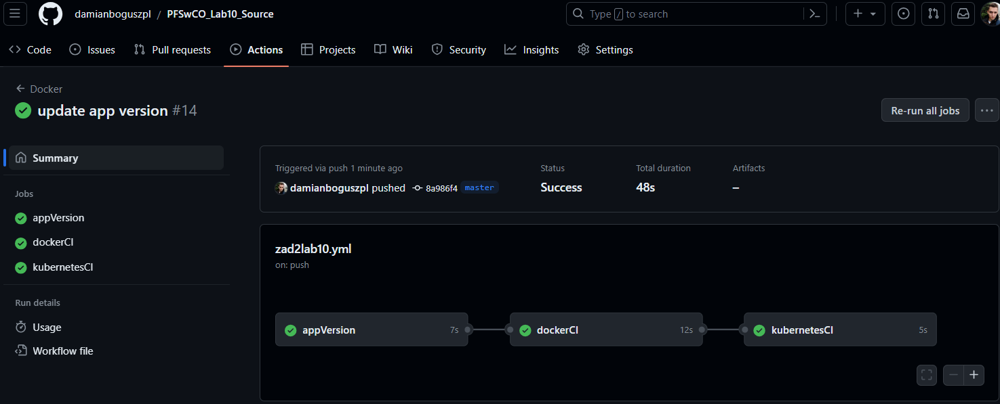
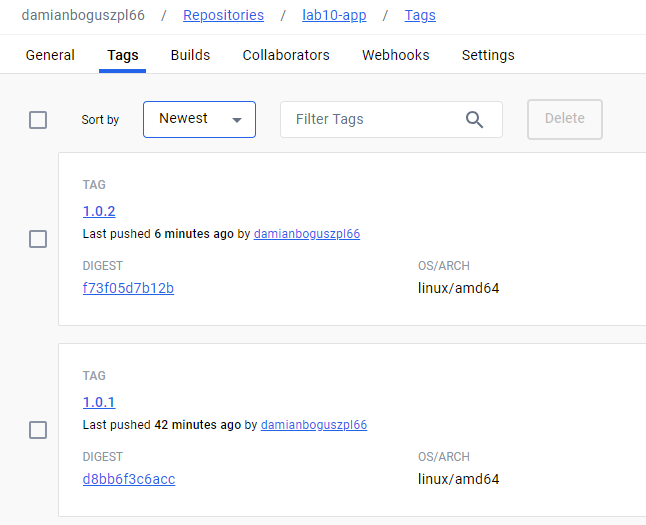
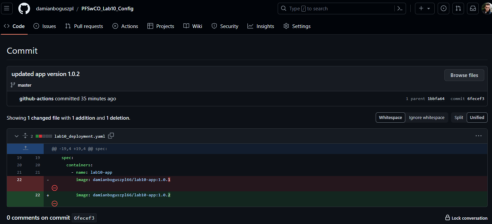
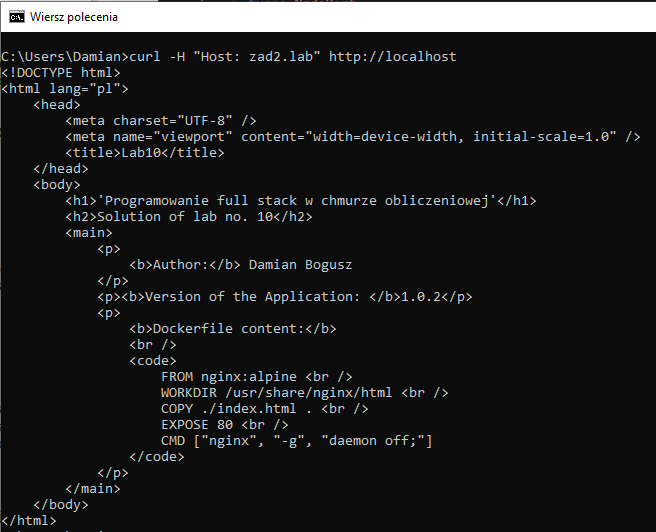
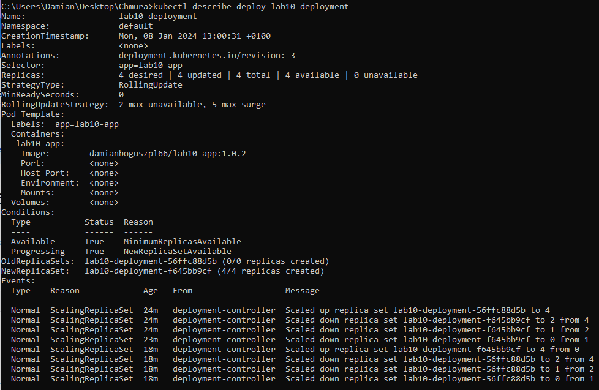

# Instrukcja realizacji laboratorium nr 10

## Krok 1

W ramach tego kroku przygotowane zostały 2 repozytoria wymagane do realizacji zaplanowanego zadania.

• Source repo - posłużyć ma do przechowywania kodów źródłowych i plików konfiguracyjnych.
https://github.com/damianboguszpl/PFSwCO_Lab10_Source.git


• Config repo - posłużyć ma do przechowywania manifestów yaml definiujących zasoby aplikacji w klastrze K8S.
https://github.com/damianboguszpl/PFSwCO_Lab10_Config.git


### W repozytorium Source przygotowane zostały następujące pliki:

#### index.html - zawierający:

- imię i nazwisko studenta,
- numer (nazwę) wersji aplikacji,
- zawartość pliku Dockerfile pozwalającego na zbudowanie obrazu Docker tworzonej aplikacji.

```html
<!DOCTYPE html>
<html lang="pl">
    <head>
        <meta charset="UTF-8" />
        <meta name="viewport" content="width=device-width, initial-scale=1.0" />
        <title>Lab10</title>
    </head>
    <body>
        <h1>'Programowanie full stack w chmurze obliczeniowej'</h1>
        <h2>Solution of lab no. 10</h2>
        <main>
            <p>
                <b>Author:</b> Damian Bogusz
            </p>
            <p><b>Version of the Application: </b>1.0.1</p>
            <p>
                <b>Dockerfile content:</b>
                <br />
                <code>
                    FROM nginx:alpine <br />
                    WORKDIR /usr/share/nginx/html <br />
                    COPY ./index.html . <br />
                    EXPOSE 80 <br />
                    CMD ["nginx", "-g", "daemon off;"]
                </code>
            </p>
        </main>
    </body>
</html>
```

#### Dockerfile -  pozwalający na zbudowanie obrazu Docker tworzonej aplikacji

```dockerfile
FROM nginx:alpine 
WORKDIR /usr/share/nginx/html
COPY ./index.html .
EXPOSE 80
CMD ["nginx", "-g", "daemon off;"]
```

### W repozytorium Config przygotowane zostały następujące pliki:


#### lab10_deployment.yaml - plik manifest niezbędny do stworzenia zasobu Deployment (wdrożenia) aplikacji

```yaml
apiVersion: apps/v1
kind: Deployment
metadata:
  name: lab10-deployment
spec:
  replicas: 4
  selector:
    matchLabels:
      app: lab10-app
  strategy:
    type: RollingUpdate
    rollingUpdate:
      maxSurge: 5
      maxUnavailable: 2
  template:
    metadata:
      labels:
        app: lab10-app
    spec:
      containers:
        - name: lab10-app
          image: damianboguszpl66/lab10-app:1.0.1
```

#### lab10_service.yaml - plik manifest niezbędny do stworzenia zasobu Service (usługi) typu NodePort dla aplikacji

```yaml
apiVersion: v1
kind: Service
metadata:
  name: lab10-service
spec:
  type: NodePort
  ports:
    - port: 8080
      targetPort: 80
      nodePort: 30007
  selector:
    app: lab10-app
```


#### lab10_ingress.yaml - plik manifest niezbędny do stworzenia zasobu Ingress (usługi dostępu zewnętrznego) do aplikacji

```yaml
apiVersion: networking.k8s.io/v1
kind: Ingress
metadata:
  name: lab10-ingress
spec:
  rules:
    - host: zad2.lab
      http:
        paths:
          - pathType: Prefix
            path: "/"
            backend:
              service:
                name: lab10-service
                port:
                  number: 8080
```


## Krok 2

### W repozytorium *Source* przygotowany został plik *.github/workflows/zad2lab10.yml*. Zadania, które ma pełnić:
- zbudowanie obrazu dla wybranych architektur sprzętowych
- nadanie tag-u i przesłanie obrazu do swojego, publicznego repo na DockerHub
- odpowiednia modyfikacja manifestów yaml na repozytorium *Config*.

```yml
name: Docker

on:
  push:
    branches: ["master"]
  pull_request:
    branches: ["master"]

jobs:
  appVersion:
    runs-on: ubuntu-latest
    outputs:
      version_number: ${{ steps.vars.outputs.version_number }}
    steps:
      - name: Check out the repo
        uses: actions/checkout@v4
      - name: set-output
        id: vars
        run: |
          version_number=$(sed -n 's/.*<b>Version of the Application: <\/b>\(.*\)<\/p>.*/\1/p' index.html)
          echo "version_number=${version_number}" >> "$GITHUB_OUTPUT"
        shell: bash

  dockerCI:
    needs: appVersion
    runs-on: ubuntu-latest
    steps:
      - name: Check out the repo
        uses: actions/checkout@v4
      - name: Set up QEMU
        uses: docker/setup-qemu-action@v3
      - name: Set up Docker Buildx
        uses: docker/setup-buildx-action@v3
      - name: Login to Docker Hub
        uses: docker/login-action@v3
        with:
          username: ${{ secrets.DOCKER_HUB_LOGIN }}
          password: ${{ secrets.DOCKER_HUB_PASSWORD }}
      - name: Build and push
        uses: docker/build-push-action@v5
        with:
          context: .
          push: true
          tags: damianboguszpl66/lab10-app:${{ needs.appVersion.outputs.version_number}}

  kubernetesCI:
    needs: [appVersion, dockerCI]
    runs-on: ubuntu-latest
    steps:
      - name: Check out the repo
        uses: actions/checkout@v4
        with:
          repository: damianboguszpl/PFSwCO_Lab10_Config
          token: ${{ secrets.ACTIONS_TOKEN }}
      - run: |
          sed -i 's/damianboguszpl66\/lab10-app:.*/damianboguszpl66\/lab10-app:${{ needs.appVersion.outputs.version_number }}/g' lab10_deployment.yaml
          git config user.name github-actions
          git config user.email github-actions@github.com
          git add -u
          git commit -m "updated app version ${{ needs.appVersion.outputs.version_number }}"
          git push

```

W przedstawionym pliku zdefiniowane zostały 3 zadania (ang. Jobs):
1. appVersion - w celu określania wersji aplikacji
2. dockerCI - w celu budowy obrazu Docker i przesyłania go na platformę DockerHub
3. kubernetesCI - w celu modyfikacji manifestów aplikacji.


## Krok 3

### Przygotowany został plik Operatora będącego obiektem CronJob *operator_stepcd.yaml*.

Manifest obiektu CronJob o nazwie StepCD ma realizować następujące zadania:
- ma co dwie minuty klonować zawartość repozytorium Config repo do katalogu tymczasowego */temp* w systemie plików kontenera,
- ma co dwie minuty uruchamiać manifesty znajdujące się w katalogu */temp* a w ten sposób inicjalizować proces aktualizacji aplikacji. Parametry tej aktualizacji są podane wyżej. 
- zadanie uruchamiania/aktualizacji ma być realizowane z uprawnieniami konta gitops.

Zawartość pliku *operator_stepcd.yaml*:

```yaml
apiVersion: batch/v1
kind: CronJob
metadata:
  name: stepcd
spec:
  schedule: "*/2 * * * *"
  concurrencyPolicy: Forbid
  jobTemplate:
    spec:
      backoffLimit: 0
      template:
        spec:
          restartPolicy: Never
          serviceAccountName: gitops
          containers:
            - name: zad2gitops
              image: damianboguszpl66/zad2gitops
              command: [sh, -e, -c]
              args:
                - git clone https://github.com/damianboguszpl/PFSwCO_Lab10_Config.git /temp/lab10_config && find /temp/lab10_config -name '*.yaml' -exec kubectl apply -f {} \;

```

Utworzony na potrzeby Operatora obraz zad2gitops, bazujący na *alpine:latest* przygotowany został zgodnie z następującym plikiem *dockerfile*:

```dockerfile
FROM alpine:latest
RUN apk update && \
    apk add --no-cache git curl && \
    apk add --no-cache --repository=http://dl-cdn.alpinelinux.org/alpine/edge/community kubectl
CMD ["/bin/sh"]
```

Zbudowanie i umieszczenie obrazu w repozytorium wykonać można przy pomocy następujących poleceń:

```bash
docker build -t damianboguszpl66/zad2gitops .

docker push damianboguszpl66/zad2gitops:latest
```


Przed uruchomieniem Operatora konieczne jest wykonanie następujących poleceń:

```bash
kubectl create sa gitops

kubectl create clusterrolebinding gitops-admin --clusterrole=cluster-admin --serviceaccount default:gitops
```

Stworzenie i uruchomienie Operatora:

```bash
kubectl apply -f operator-stepcd.yaml
```

## Krok 4

### Krok ten obejmuje wykorzystanie opracowanego łańcucha zadań CI/CD.

a) Wyświetlenie utworzonych i pracujących zasobów:





b) Sprawdzenie dostępności opracowanej aplikacji przy dostępie z wykorzystaniem zasobu Ingress, poprzedzone uruchomieniem Tunelu minikube:





c) Zmiana wersji aplikacji w kodzie źródłowym:



d) Uruchomienie opracowanego łańcucha zadań w GA (realizowane automatycznie):



e) Sprawdzenie czy proces aktualizacji aplikacji został zrealizowany z założeniami.

- utworzenie nowej wersji obrazu aplikacji w *DockerHub*:



- aktualizacja wersji aplikacji w repozytorium *Config*



f) Sprawdzenie dostępności opracowanej aplikacji i obserwacja zmiany wersji.



Jak widać na załączonej grafice, zaktualizowana wersja aplikacji widoczna jest w nowej wersji aplikacji.

Zaktualizowana wersja aplikacji zgodnie z założeniami korzysta teraz z nowej wersji obrazu, co pokazuje następujący screenshot:


