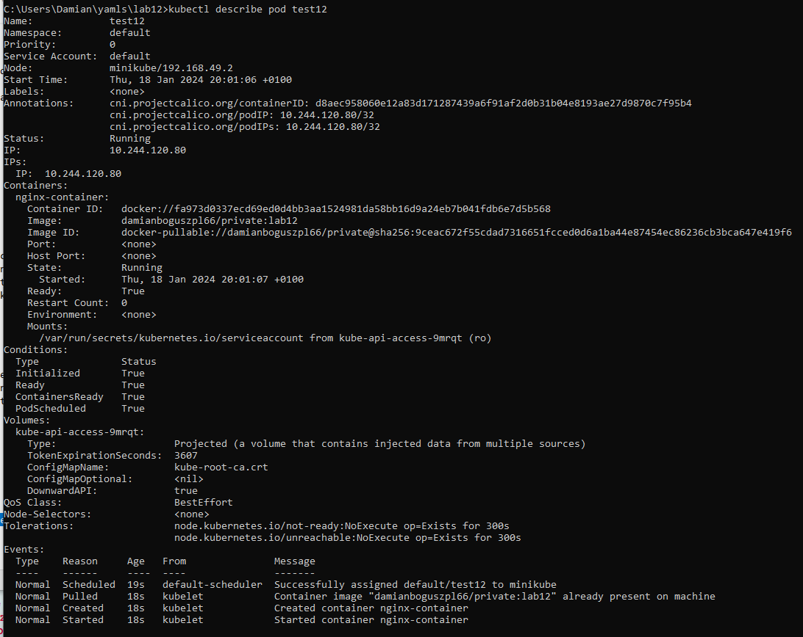

# Instrukcja realizacji laboratorium

## 1. Założenie prywatnego repozytorium na DockerHub


## 2. Przygotowanie pliku Dockerfile

Dockerfile:
```dockerfile
FROM nginx:latest
```

## 3. Zbudowanie obrazu i przesłanie go do utworzonego wcześniej repozytorium z tagiem: *lab12*

```bash
docker build -t damianboguszpl66/private:lab12 .
docker login
docker push damianboguszpl66/private:lab12
```


## 4. Przygotowanie manifestu Pod-a *test12*

Specyfikacja Pod-a:
- utworzony w domyślnej przestrzeni nazw,
- o nazwie test12,
- w oparciu o odpowiednio skonfigurowany obiekt Secret, będzie wykorzystywał obraz znajdujący się na utworzonym wcześniej prywatnym repozytorium.

test12.yaml:
```bash
apiVersion: v1
kind: Pod
metadata:
  name: test12
spec:
  containers:
  - name: nginx-container
    image: damianboguszpl66/private:lab12
  imagePullSecrets:
  - name: my-dockerhub-secret
```
## 5. Utworzenie obiektu Secret, wykorzystującego token wygenerowany na DockerHub (zamiast hasła)

```bash
kubectl create secret docker-registry my-dockerhub-secret --docker-server=https://index.docker.io/v1/ --docker-username=damianboguszpl66 --docker-password=********************************************
```


```bash
kubectl get secret
```

Poniżej widać poprawnie utworzony obiekt Secret.


## 6. Utworzenie poda bazując na manifeście

```bash
kubectl apply -f test12.yaml
```


## 7. Sprawdzenie poprawności konfiguracji utworzonego poda

```bash
kubectl get pod
kubectl describe pod test12 
```

Na załączonym zdjęciu widać iż Pod działa poprawnie.


Poniżej widać iż Pod wykorzystuje poprawny obraz.



