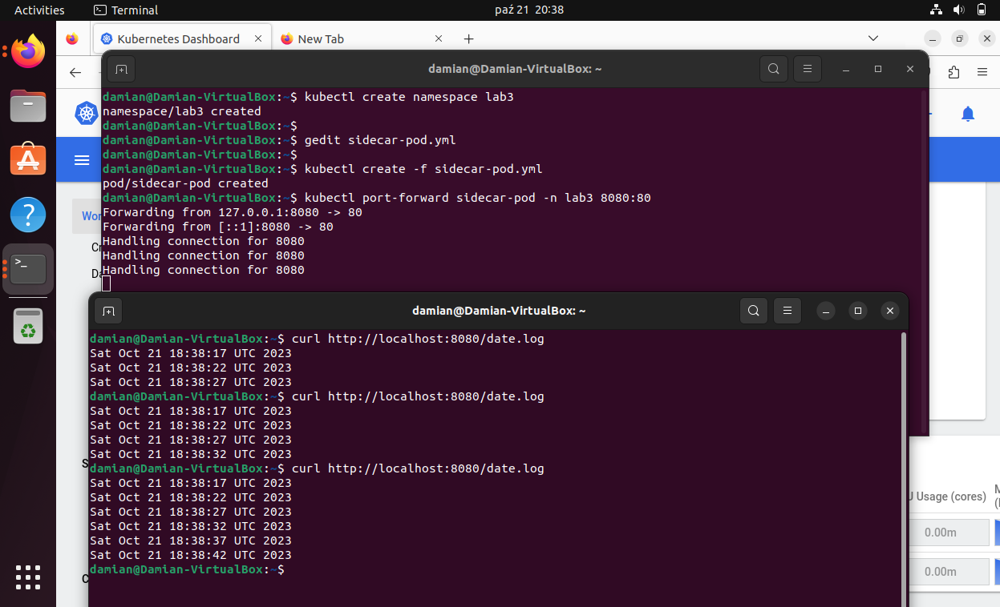

# Zawartość pliku 'sidecar-pod.yml'

W wylistowanym poniżej pliku zawarta została konfiguracja wymagana do stworzenia poda wielokontenerowego typu sidecar, zgodnie z zadaniem laboratoryjnym.

```yml
apiVersion: v1
kind: Pod
metadata:
  name: sidecar-pod
  namespace: lab3
spec:
  containers:
    - name: busybox-container
      image: busybox
      command:
        - "sh"
        - "-c"
        - "while true; do date >> /var/log/date.log; sleep 5; done"
      volumeMounts:
        - name: shared-volume
          mountPath: /var/log
    - name: nginx-sidecar
      image: nginx
      ports:
        - containerPort: 80
      volumeMounts:
        - name: shared-volume
          mountPath: /usr/share/nginx/html
  dnsPolicy: ClusterFirst
  restartPolicy: Always
  volumes:
    - name: shared-volume
```

# Instrukcja stworzenia poda

1. Przygotowanie pliku konfigurayjnego 'sidecar-pod.yml'

2. Utworzenie wymaganej przestrzeni nazw 'lab3'

```bash
kubectl create namespace lab3
```

3. Utworzenie poda

```bash
kubectl create -f sidecar-pod.yml
```

# Sprawdzenie poprawności działania poda zgodnie z zamierzeniem

1. Włączenie przekazywania portu

```bash
kubectl port-forward sidecar-pod -n lab3 8080:80
```

2. Wyświetlenie pliku logów

```bash
curl http://localhost:8080/date.log
```

3. Efekt 

