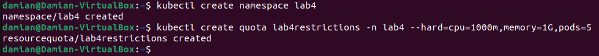
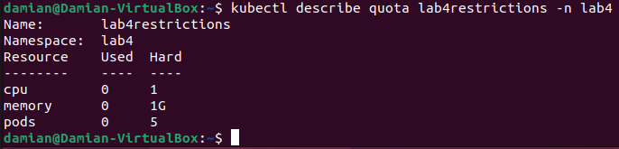
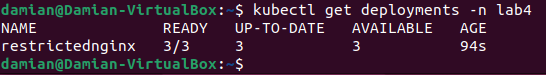
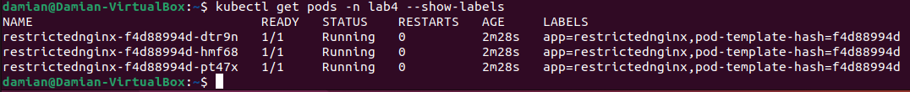
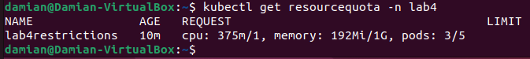
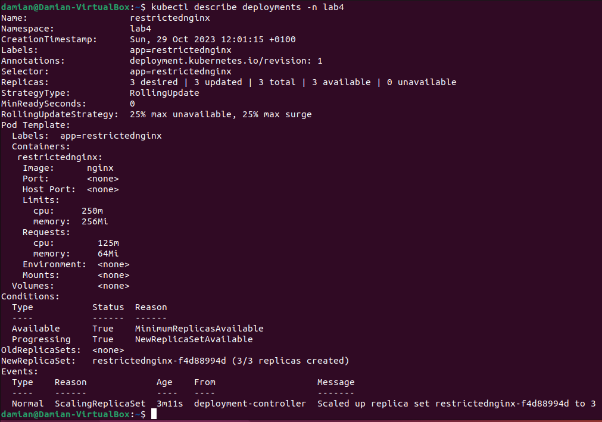
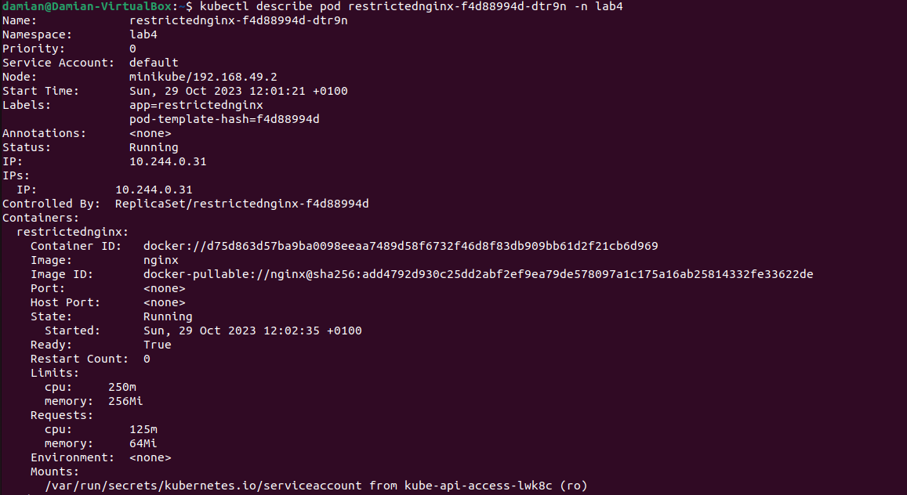
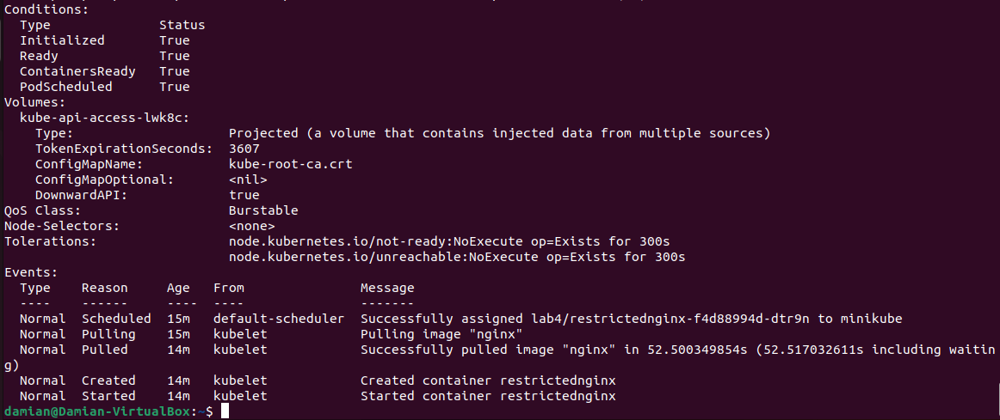

# Instrukcja realizacji laboratorium

1. Utworzenie przestrzeni nazw `lab4`.
```bash
kubectl create namespace lab4
```

2. Utworzenie quota z ograniczeniami (5 podów, cpu: 1000 millicore , RAM: 1GiB) i przypisanie jej do przestrzeni nazw `lab4`.
```bash
kubectl create quota lab4restrictions -n lab4 --hard=cpu=1000m,memory=1G,pods=5
```



Jak widać na poniższym zdjęciu, quota została utworzona i nałożona na przestrzeń nazw `lab4` zgodnie z wymaganiami. W obecnym momencie nie są wykorzystywane żadne zasoby.



3. Przygotowanie pliku `restricted-nginx.yml` z konfiguracją Deployment o nazwie `restrictednginx` w przestrzeni nazw `lab4` z 3 pod-ami, gdzie każdy Pod początkowo żąda: 64 MiB RAM oraz 125m CPU, a górny limit zasobów to 256 MiB RAM oraz 250m CPU.

``` yml
apiVersion: apps/v1
kind: Deployment
metadata:
  name: restrictednginx
  namespace: lab4
  labels:
    app: restrictednginx
spec:
  replicas: 3
  selector:
    matchLabels:
      app: restrictednginx
  template:
    metadata:
      labels:
        app: restrictednginx
    spec:
      containers:
        - name: restrictednginx
          image: nginx
          resources:
            requests:
              memory: "64Mi"
              cpu: "125m"
            limits:
              memory: "256Mi"
              cpu: "250m"
```

4. Utworzenie Deploymentu korzystając z przygotowanego pliku.
```bash
kubectl create -f restrictednginx.yml
```

5. Sprawdzenie poprawności utowrzenia Deploymentu.
```bash
kubectl get deployments -n lab4
```



Deployemnt został utoworzony i uruchomiony.

6. Wyświetlenie utworzonych podów.
```bash
kubectl get pods -n lab4 --show-labels
```



Utworzone w ramach Deployemntu pody(repliki) zostały uruchomione i działają poprawnie.

7. Sprawdzenie utworzonej wcześniej quoty.
```bash
kubectl get resourcequota -n lab4
```



Jak widać na załączonym zdjęciu w przestrzeni nazw działa nałożona wcześniej quota. W przestrzeni nazw mamy 3 pody zajmujące 3 z 5 możliwych miejsc. Widzimy także ilość dostępnych zasobów oraz ilość zasobów o które poprosiły działające pody.

8. Wyświetlenie szczegółów utworzonego Deploymentu.
```bash
kubectl describe deployments -n lab4
```



Utworzony deployment działa zgodnie z założeniami. Pracują w nim 3 repliki.

9. Wyświetlenie szczegółów jednego z utworzonych podów.
```bash
kubectl describe pod restrictednginx-f4d88994d-dtr9n -n lab4
```




Jak można zauważyć, pod działa poprawnie oraz ma skonfigurowane ograniczenia zasobów zgodnie z założeniami zadania.

