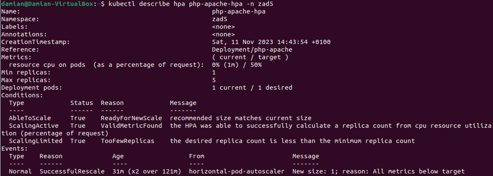

# Instrukcja realizacji laboratorium


## 1. Przygotowanie pliku yaml tworzącego zestaw ograniczeń na zasoby dla przestrzeni nazw 'zad5'.

Przygotowany plik yaml - 'zad5_namespace_quota.yaml' powinien mieć następującą zawartość:

```yaml
apiVersion: v1
kind: ResourceQuota
metadata:
  name: zad5-ns-resource-quota
  namespace: zad5
spec:
  hard:
    pods: "10"
    limits.cpu: "2000m"
    limits.memory: "1.5Gi"
```

## 2. Przygotowanie pliku yaml tworzącego Poda 'worker' w przestrzeni nazw 'zad5', bazującego na obrazie 'nginx' i posiadającego zadane ograniczenia na zasoby.

Przygotowany plik yaml - 'zad5_worker.yaml' powinien mieć następującą zawartość:

```yaml
apiVersion: v1
kind: Pod
metadata:
  name: worker
  namespace: zad5
spec:
  containers:
  - name: nginx-container
    image: nginx
    resources:
      limits:
        memory: "200Mi"
        cpu: "200m"
      requests:
        memory: "100Mi"
        cpu: "100m"
```


## 3. Przygotowanie pliku yaml tworzącego Deployment i Service w przestrzeni nazw 'zad5'. Deeployment posiadać ma zadane ograniczenia zasobów.

Przygotowany plik yaml - 'zad5_php-apache_deployment_service.yaml' powinien mieć następującą zawartość:

```yaml
apiVersion: apps/v1
kind: Deployment
metadata:
  name: php-apache
  namespace: zad5
spec:
  selector:
    matchLabels:
      run: php-apache
  template:
    metadata:
      labels:
        run: php-apache
    spec:
      containers:
      - name: php-apache
        image: registry.k8s.io/hpa-example
        ports:
        - containerPort: 80
        resources:
          limits:
            memory: "250Mi"
            cpu: "250m"
          requests:
            memory: "150Mi"
            cpu: "150m"
---
apiVersion: v1
kind: Service
metadata:
  name: php-apache
  namespace: zad5
  labels:
    run: php-apache
spec:
  ports:
  - port: 80
  selector:
    run: php-apache
```

## 4. Przygotowanie pliku yaml tworzącego HorizontalPodAutoscaler, który pozwoli na autoskalowanie wdrożenia (Deployment).

Przygotowany plik yaml - 'zad5_php-apache_hpa.yaml' powinien mieć następującą zawartość:

```yaml
apiVersion: autoscaling/v2
kind: HorizontalPodAutoscaler
metadata:
  name: php-apache-hpa
  namespace: zad5
spec:
  scaleTargetRef:
    apiVersion: apps/v1
    kind: Deployment
    name: php-apache
  minReplicas: 1
  maxReplicas: 5
  metrics:
  - type: Resource
    resource:
      name: cpu
      target:
        type: Utilization
        averageUtilization: 50
```


Wartość parametru maxReplicas w konfiguracji HPA powinna być zgodna z ograniczeniami zasobów na poziomie przestrzeni nazw. W rozpatrywanym przypadku przestrzeń nazw 'zad5' ma narzucone ograniczenia na CPU (2000m) i RAM (1,5Gi), a maksymalna liczba podów pracujących w tej przestrzeni to 10.
Parametr maxReplicas powinien zostać ustawiony tak, aby suma zasobów wszystkich replik (i innych podów w namespace) nie przekraczała tych ograniczeń.
W związku z tym, iż na pojedynczą replikę (Poda) Deployment narzuca ograniczenie maksymalnych dostępnych zasobów ('limits') na 'memory: 250Mi' i 'cpu: 250m', maksymalną liczbę Replik możnaby ustawić na liczbę 6, co spełnia obowiązujące ograniczenia. W namespace działa jednak jeszcze Pod 'worker', w związku z czym bezpieczniejsze będzie ustawienie wartości maxReplicas na 5.


## 5. Utworzenie obietków zadeklarowanych w plikach yaml.

5.1. Utworzenie przestrzeni nazw 'zad5':

```bash
kubectl create namespace zad5
```


5.2. Utworzenie ograniczeń zasobów Quota na przestrzeni nazw 'zad5':

```bash
kubectl apply -f zad5_namespace_quota.yaml
```


5.3. Utworzenie Poda 'worker':

```bash
kubectl apply -f zad5_worker.yaml
```


5.4. Utworzenie Deployment i Service:

```bash
kubectl apply -f zad5_php-apache_deployment_service.yaml
```


5.5. Utworzenie HorizontalPodAutoscaler:

```bash
kubectl apply -f zad5_php-apache_hpa.yaml
```


5.6. Potwierdzenie poprawności utworzenia zasobów:

a) Namespace & Quota


b) Deployment


c) Service


d) HorizontalPodAutoscaler




e) Worker Pod


## 6. Generowanie obciążenia i test autoskalowania wdrożenia aplikacji

6.1. Przygotowanie pliku 'load_generator_pod.yaml' z konfiguracją lekkiego Poda generującego obciążenie:

```yaml
apiVersion: v1
kind: Pod
metadata:
  name: load-generator
  namespace: zad5
spec:
  containers:
  - name: busybox
    image: busybox:1.28
    resources:
      limits:
        memory: "64Mi"
        cpu: "50m"
      requests:
        memory: "32Mi"
        cpu: "25m"
    command: ["/bin/sh", "-c"]
    args: ["while sleep 0.01; do wget -q http://php-apache/; done"]
  restartPolicy: Never
  terminationGracePeriodSeconds: 0
```

6.2. Utworzenie Poda:

```bash
kubectl apply -f load_generator_pod.yaml
```


6.3. Obserwacje
Po pewnym w czasie, w efekcie zwiększonego zużycia zasobów przez wdrożoną aplikację HPA spowodował utworzenie dodatkowych replik. Działające Pod-y:


Warta prześledzenia jest również sekcja Events na poniższym zdjęciu:


Kolejnym krokiem będzie usunięcie Poda generującego obciążenie:

```bash
kubectl delete pod load-generator -n zad5
```


W efekcie zmniejszonego wykorzystania zasobów, po pewnym czasie nadmiarowe repliki zostaną usunięte.


Jak widać powyżej, zbędne repliki zostały usunięte.
